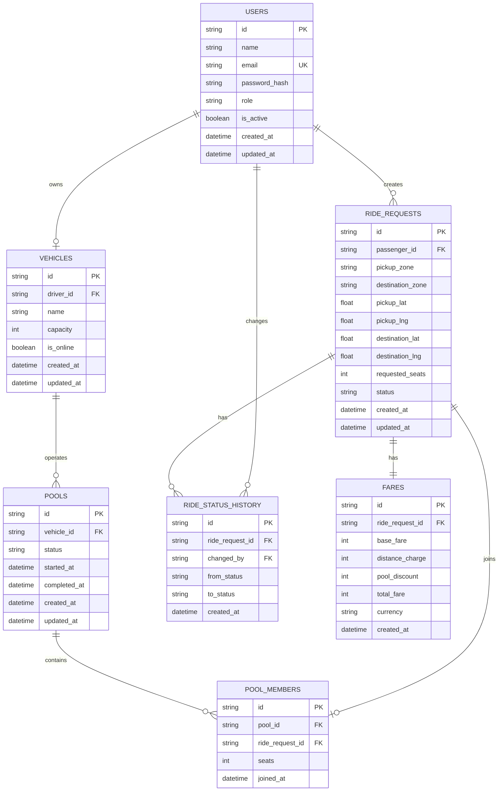

# Dhaka Tesla Pool — ERD

## Relationship Summary

- One driver owns one vehicle in the MVP.
- One passenger can create many ride requests.
- One vehicle can operate many pools over time.
- One pool contains multiple pool members.
- One ride request can belong to at most one pool.
- One ride request has a status history.
- One user can perform multiple status changes.
- One ride request has one fare record.