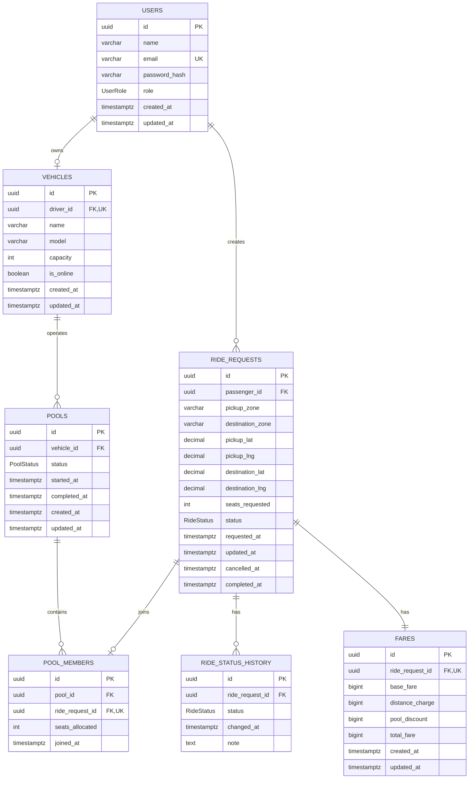

# Dhaka Tesla Pool — ERD

The following entity relationship diagram represents the current PostgreSQL database schema used by the MVP.

## Entity Relationship Diagram


```mermaid
erDiagram

    USERS ||--o| VEHICLES : owns
    USERS ||--o{ RIDE_REQUESTS : creates
    VEHICLES ||--o{ POOLS : operates
    POOLS ||--o{ POOL_MEMBERS : contains
    RIDE_REQUESTS ||--o| POOL_MEMBERS : joins
    RIDE_REQUESTS ||--o{ RIDE_STATUS_HISTORY : has
    RIDE_REQUESTS ||--|| FARES : has

    USERS {
        uuid id PK
        varchar name
        varchar email UK
        varchar password_hash
        UserRole role
        timestamptz created_at
        timestamptz updated_at
    }

    VEHICLES {
        uuid id PK
        uuid driver_id FK,UK
        varchar name
        varchar model
        int capacity
        boolean is_online
        timestamptz created_at
        timestamptz updated_at
    }

    RIDE_REQUESTS {
        uuid id PK
        uuid passenger_id FK
        varchar pickup_zone
        varchar destination_zone
        decimal pickup_lat
        decimal pickup_lng
        decimal destination_lat
        decimal destination_lng
        int seats_requested
        RideStatus status
        timestamptz requested_at
        timestamptz updated_at
        timestamptz cancelled_at
        timestamptz completed_at
    }

    POOLS {
        uuid id PK
        uuid vehicle_id FK
        PoolStatus status
        timestamptz started_at
        timestamptz completed_at
        timestamptz created_at
        timestamptz updated_at
    }

    POOL_MEMBERS {
        uuid id PK
        uuid pool_id FK
        uuid ride_request_id FK,UK
        int seats_allocated
        timestamptz joined_at
    }

    RIDE_STATUS_HISTORY {
        uuid id PK
        uuid ride_request_id FK
        RideStatus status
        timestamptz changed_at
        text note
    }

    FARES {
        uuid id PK
        uuid ride_request_id FK,UK
        bigint base_fare
        bigint distance_charge
        bigint pool_discount
        bigint total_fare
        timestamptz created_at
        timestamptz updated_at
    }
```

## Relationship Summary

- One driver can own at most one vehicle in the MVP.
- One passenger can create many ride requests.
- One vehicle can operate many pools over time.
- One pool contains multiple pool members.
- One ride request can belong to at most one pool.
- One ride request has multiple status-history records.
- One ride request has exactly one fare record.
- `Vehicle.driverId` is unique, enforcing one vehicle per driver.
- `PoolMember.rideRequestId` is unique, preventing the same ride request from joining multiple pools.
- `Fare.rideRequestId` is unique, enforcing one fare record per ride request.

## Database Entities

### Users

The `users` table stores both passengers and drivers.

The `role` field determines whether the user is a:

- `PASSENGER`
- `DRIVER`

Each user has a unique email address.

### Vehicles

The `vehicles` table represents the Tesla vehicles operated by drivers.

Each driver can have at most one vehicle.

Important fields include:

- `driver_id`
- `name`
- `model`
- `capacity`
- `is_online`

The vehicle capacity is used by the pool-matching logic to prevent over-allocation of seats.

### Ride Requests

The `ride_requests` table stores passenger ride requests.

A request contains:

- Pickup zone
- Destination zone
- Optional pickup coordinates
- Optional destination coordinates
- Requested seat count
- Current ride status
- Request and lifecycle timestamps

The main ride states are:

```text
REQUESTED
MATCHED
DRIVER_ARRIVED
STARTED
COMPLETED
CANCELLED
```

### Pools

The `pools` table represents a shared ride operated by a vehicle.

A pool belongs to one vehicle and can contain multiple ride requests through `PoolMember`.

Pool states are:

```text
OPEN
STARTED
COMPLETED
CANCELLED
```

### Pool Members

The `pool_members` table connects ride requests to pools.

Each record stores:

- The pool
- The ride request
- The number of allocated seats
- The time the passenger joined

A ride request can belong to at most one pool because `ride_request_id` is unique.

### Ride Status History

The `ride_status_history` table records changes in a ride's lifecycle.

Each record stores:

- Ride request
- New status
- Change timestamp
- Optional note

The history provides an audit trail of ride-state changes.

The current implementation stores the resulting status rather than separate `from_status` and `to_status` fields. The ordered history records represent the lifecycle sequence.

### Fares

The `fares` table stores the fare calculation for each ride request.

Each ride has exactly one fare record.

The fare contains:

- `base_fare`
- `distance_charge`
- `pool_discount`
- `total_fare`

The values are stored as `BigInt` integers rather than floating-point values.

## Pool Capacity Rule

Pool occupancy is calculated from the allocated seats of its members:

```text
occupiedSeats =
sum(seats_allocated for pool members)
```

A new ride can join a pool only when:

```text
occupiedSeats + requestedSeats <= vehicle.capacity
```

The backend also rejects a ride request when:

```text
requestedSeats > vehicle.capacity
```

This ensures that a Tesla's capacity cannot be exceeded.

## Concurrency Protection

Pool matching is performed inside a PostgreSQL transaction using:

```text
SERIALIZABLE
```

transaction isolation.

The vehicle row is also locked using:

```sql
SELECT id
FROM vehicles
WHERE id = ...
FOR UPDATE
```

This ensures that concurrent ride-matching requests cannot incorrectly allocate the same remaining seats.

The backend includes an automated concurrency test for this scenario.

## Ride Ownership

Each ride request references its passenger through:

```text
ride_requests.passenger_id → users.id
```

Passenger authorization is enforced by the service layer.

A passenger can only access or cancel their own ride request.

## Monetary Values

Fare values are stored as integer `BigInt` values instead of floating-point numbers.

The current fare structure is:

```text
baseFare
distanceCharge
poolDiscount
totalFare
```

The MVP uses integer fare units to avoid floating-point precision problems.

A production implementation can explicitly define these integer values as Bangladeshi poysha.

## Indexes and Constraints

The database includes indexes and constraints for commonly accessed relationships and business rules.

Examples include:

- Unique user email
- Unique vehicle per driver
- Unique pool membership per ride request
- Unique fare per ride request
- Ride status index
- Passenger ID index
- Pool vehicle/status indexes
- Ride request timestamp index
- Ride status history indexes

These constraints support data consistency and efficient querying.